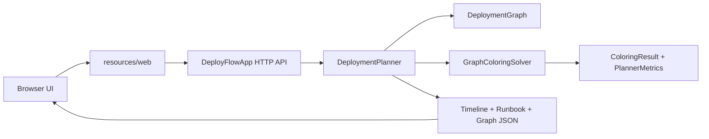

# DeployFlow

DeployFlow is a Java web application that plans safe software deployment windows with a graph coloring algorithm.

The application answers a practical question: if several services must be deployed today, which deployments can run at the same time and which must be separated?

Repository: https://github.com/WitherGH/deployflow-project

Live GitHub Pages demo: https://withergh.github.io/deployflow-project/

## What The App Does

DeployFlow takes a list of deployment tasks. Each task has a service name, owner team, risk level, duration, dependencies, resources, and tags.

The planner converts these tasks into a conflict graph:

| Deployment planning idea | Graph coloring idea |
| --- | --- |
| One deployment task | Vertex |
| Unsafe parallel relation | Edge |
| Release window | Color |
| Valid release plan | Valid graph coloring |

If two deployments have an edge between them, they cannot receive the same color. In product language, they cannot be placed in the same release window.

The result is a release timeline, a conflict graph, an operator runbook, and algorithm metrics.

## Where It Can Be Used

This project can be used as a teaching example for the map coloring problem and graph coloring. It also represents a realistic engineering workflow:

- release managers can separate risky deployments;
- engineering teams can avoid deploying two services that need the same owner at the same time;
- teams can see which shared infrastructure causes conflicts;
- students can explain how a classical algorithm becomes a working product.

## How The Algorithm Works

DeployFlow contains two graph coloring modes.

### Classical Mode

Classical mode uses recursive backtracking.

1. Start with the first vertex.
2. Try color 1, then color 2, and so on.
3. A color is valid only if no already-colored neighbor has the same color.
4. If the current vertex gets a valid color, move to the next vertex.
5. If no color works, remove the previous assignment and try a different color.
6. If all vertices are colored, a valid plan was found.

This method is complete: if a valid coloring exists for the selected number of colors, it can find it. Its weakness is speed on large or dense graphs because the number of possible assignments grows quickly.

### Improved Mode

Improved mode keeps the same graph coloring idea but chooses the search order more carefully.

It adds:

- most constrained vertex first: choose the deployment with the fewest valid windows left;
- degree tie-breaker: if there is a tie, choose the deployment with the most conflict edges;
- risk tie-breaker: if there is still a tie, choose the higher-risk deployment;
- least-constraining color: try the window that leaves more options for related deployments;
- forward checking: after placing a deployment, check whether every unplaced deployment still has at least one valid window;
- dependency order validation: if deployment A depends on deployment B, B must be in an earlier window.

The improved algorithm is still backtracking, but it avoids many weak branches earlier.

## Code Structure

```text
src/com/deployflow/core/algorithm/GraphColoringSolver.java
  Implements classical and improved graph coloring.

src/com/deployflow/core/planner/DeploymentPlanner.java
  Builds the deployment conflict graph and converts solver output into timeline, runbook, metrics, and UI data.

src/com/deployflow/core/model/
  Contains data classes: deployment task, graph, result, options, metrics, risk level, and conflict reason.

src/com/deployflow/core/util/MapReader.java
  Reads typed values from request maps without coupling core classes to web classes.

src/com/deployflow/core/data/SampleCatalog.java
  Provides the demo deployment catalog.

src/com/deployflow/web/DeployFlowApp.java
  Starts the Java HTTP server, serves static files, and exposes API endpoints.

src/com/deployflow/web/Json.java
  Small dependency-free JSON parser and writer.

resources/web/
  Frontend files: HTML, CSS, and JavaScript.

docs/CODE_WALKTHROUGH_UA.md
  Detailed Ukrainian explanation of every file and the full execution flow.
```

## Architecture Graph



## Run Locally

Requirements:

- Java 17 or newer.
- No Maven, Gradle, Node, or database is required.

Run the web app:

```bash
./run.sh
```

Then open:

```text
http://localhost:8080
```

Run on another port:

```bash
./run.sh 8090
```

Run the console demo:

```bash
./run-demo.sh
```

Windows:

```bat
run.bat
run-demo.bat
```

## Free Hosting

The project has a static GitHub Pages demo and is also ready for free Render hosting with `Dockerfile` and `render.yaml`.

The GitHub Pages demo uses the same interface and a browser-side fallback planner, so reviewers can test the workflow without waiting for a backend service to wake up.

Render currently supports free web services for previews, hobby projects, and testing. Free services have limitations such as sleeping after inactivity and monthly usage limits, so this is suitable for a defense demo, not production.

One-click deploy link:

https://render.com/deploy?repo=https://github.com/WitherGH/deployflow-project

Deployment steps:

1. Open the one-click deploy link above.
2. Sign in to Render with GitHub.
3. Give Render access to the `WitherGH/deployflow-project` repository if it asks.
4. Render will read `render.yaml`.
5. Keep the service plan as `free`.
6. After deployment, Render will show a public URL for the service. That URL is the demo link to share with reviewers.

Official Render references:

- https://render.com/docs/free
- https://render.com/docs/blueprint-spec

## Important Documentation

- Detailed code explanation: `docs/CODE_WALKTHROUGH_UA.md`
- Final report draft: `docs/FINAL_REPORT_DRAFT.md`
- Presentation script: `docs/PRESENTATION_SCRIPT.md`
- One-page abstract: `docs/ONE_PAGE_ABSTRACT.md`
- Screenshots: `docs/screenshots/`
