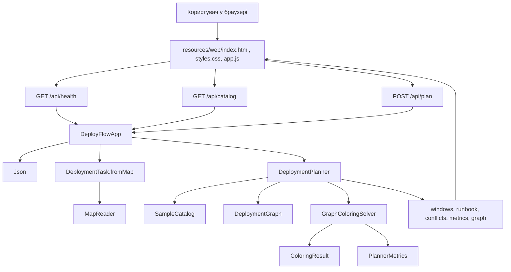
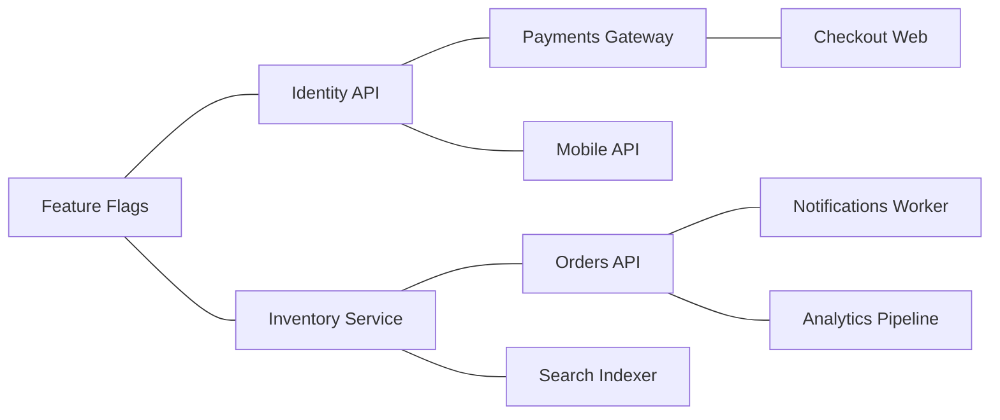

# DeployFlow: пояснення архітектури, файлів і алгоритму

Цей документ написаний для швидкого самостійного розбору проєкту перед захистом. Його мета: пояснити, що робить кожен файл, як дані проходять через застосунок, де саме використовується graph coloring, які архітектурні рішення вже є сильними, а які були покращені.

## Як прочитати проєкт за 30 хвилин

1. Прочитай розділ "Ідея застосунку".
2. Подивись граф архітектури.
3. Прочитай пояснення файлів у такому порядку:
   `DeploymentTask`, `DeploymentPlanner`, `DeploymentGraph`, `GraphColoringSolver`, `DeployFlowApp`, `resources/web/app.js`.
4. Запусти `./run-demo.sh`, потім `./run.sh`.
5. У веб-інтерфейсі натисни `Generate plan` і подивись на `Conflict graph`, `Release timeline`, `Operator runbook`, `Planner insights`.

## Ідея застосунку

DeployFlow планує релізи програмних сервісів.

У реальному житті декілька команд можуть захотіти зробити релізи в один день. Не всі релізи можна запускати паралельно. Наприклад:

- два релізи належать одній команді, тому одні й ті самі люди не можуть якісно контролювати обидва;
- два релізи використовують одну базу даних, чергу або кеш;
- один реліз залежить від іншого і має йти після нього;
- два релізи мають високий ризик, тому їх краще не поєднувати в одному часовому вікні.

DeployFlow перетворює цю задачу на задачу розфарбування графа.

| У DeployFlow | У graph coloring |
| --- | --- |
| Deployment task, тобто один реліз сервісу | Vertex, тобто вершина графа |
| Конфлікт між двома релізами | Edge, тобто ребро графа |
| Release window, тобто часовий слот для релізу | Color, тобто колір |
| Безпечний план релізів | Valid coloring, тобто правильне розфарбування |

Якщо між двома релізами є ребро, вони не можуть мати один колір. У застосунку це означає: вони не можуть бути в одному release window.

## Граф архітектури

## Граф даних у задачі

Це спрощений приклад. У реальному результаті ребер більше, тому що DeployFlow додає ребра не тільки за залежностями, а також за командою, ресурсами і ризиком.

## Основний потік виконання

1. Браузер відкриває `index.html`.
2. `app.js` викликає `/api/catalog`.
3. `DeployFlowApp` повертає список задач із `SampleCatalog`.
4. Користувач вибирає релізи й натискає `Generate plan`.
5. `app.js` відправляє POST-запит на `/api/plan`.
6. `DeployFlowApp` парсить JSON через `Json`.
7. `DeploymentTask.fromMap` перетворює дані запиту на Java-об'єкти.
8. `DeploymentPlanner` видаляє дублікати, будує `DeploymentGraph` і викликає `GraphColoringSolver`.
9. `GraphColoringSolver` шукає valid coloring.
10. `DeploymentPlanner` перетворює масив кольорів на зрозумілі для людини дані: часові вікна, runbook, список конфліктів, метрики.
11. `app.js` малює timeline, graph, runbook і insights.

## Оцінка архітектури

### Сильні сторони

- Проєкт невеликий і добре розділений на шари.
- Алгоритм винесений в окремий клас `GraphColoringSolver`.
- Доменна логіка побудови графа винесена в `DeploymentPlanner`.
- Моделі даних лежать у `core/model`.
- Веб-сервер дуже простий: використовується стандартний `HttpServer`, без фреймворків.
- Проєкт можна пояснювати без Maven, Gradle, Node або бази даних.
- У результаті видно не тільки план, а і причини конфліктів та метрики алгоритму.

### Що було покращено

- Прибрано залежність core-шару від web-шару. Раніше `DeploymentTask` і `PlannerOptions` використовували `com.deployflow.web.Json`. Це змішувало модель і веб-інфраструктуру. Тепер для читання значень із мап є `core/util/MapReader.java`.
- `DeployFlowApp` тепер читає порт із змінної середовища `PORT`, якщо порт не передали аргументом. Це потрібно для безкоштовного хостингу, наприклад Render.
- JSON-парсер тепер перевіряє, що після основного JSON-документа немає зайвих символів, і краще повідомляє про некоректні числа.
- Custom dependency тепер можна ввести більш природно: `Identity API`, `identity-api` та близькі варіанти розпізнаються через нормалізацію і порівняння без урахування регістру.
- Додано `Dockerfile`, `.dockerignore` і `render.yaml`, щоб проєкт можна було розгорнути як Docker web service.
- UI став легшим: зменшено візуальну важкість шрифтів, прибрано декоративні плями, прибрано негативний letter spacing, зменшено радіуси карток, збережено Inter і темний технічний стиль.

## Детальний розбір алгоритму

### Classical graph coloring

Файл: `src/com/deployflow/core/algorithm/GraphColoringSolver.java`

Метод `solveClassic(boolean[][] graph, int maxColors)` отримує звичайну матрицю суміжності:

- `graph[i][j] == true` означає, що вершини `i` і `j` мають ребро;
- `maxColors` означає максимальну кількість кольорів;
- у DeployFlow колір означає release window.

Алгоритм пробує розфарбувати граф спочатку одним кольором, потім двома, потім трьома, поки не дійде до `maxColors`.

Метод `classicColorVertex` працює рекурсивно:

1. Якщо всі вершини вже розфарбовані, повертає `true`.
2. Для поточної вершини пробує кожен колір.
3. Викликає `isClassicSafe`.
4. Якщо колір безпечний, записує його в масив `colors`.
5. Переходить до наступної вершини.
6. Якщо далі план не вийшов, скидає колір на `0` і пробує інший.

`isClassicSafe` перевіряє тільки одне правило: сусідня вершина не повинна мати той самий колір.

### Improved deployment coloring

Метод `solveDeployment(DeploymentGraph graph, int maxColors, PlannerOptions.AlgorithmMode mode)` працює з доменним графом DeployFlow.

Він враховує два типи правил:

- conflict rule: два релізи не можуть бути в одному вікні;
- precedence rule: один реліз має бути в ранішому вікні, ніж інший.

Якщо вибрано `CLASSIC`, використовується `colorByFixedOrder`. Це схоже на класичний алгоритм, але перевірка безпеки вже доменна.

Якщо вибрано `IMPROVED`, використовується `colorByHeuristicOrder`.

Покращений режим робить таке:

1. `selectMostConstrainedVertex` вибирає нерозфарбовану вершину з найменшою кількістю доступних кольорів.
2. Якщо таких вершин кілька, вибирає вершину з більшим degree, тобто більшою кількістю конфліктів.
3. Якщо знову нічия, вибирає вершину з більшим ризиком.
4. `orderColorsByLeastConstrainingValue` сортує кольори так, щоб спочатку пробувати ті, які залишають більше варіантів іншим вершинам.
5. `hasFutureOptions` робить forward checking: після поточного призначення кожна нерозфарбована вершина повинна мати хоча б один можливий колір.
6. `isDeploymentSafe` перевіряє і конфлікти, і порядок залежностей.

### Чому це graph coloring, а не просто сортування

Сортування дало б один лінійний порядок релізів. DeployFlow вирішує іншу задачу: він шукає, які релізи можуть бути паралельними, а які ні.

Графове розфарбування дозволяє розмістити декілька безпечних релізів в одному часовому вікні. Тобто результат не просто список, а групи паралельного виконання.

## Повна карта файлів

### Корінь проєкту

| Файл або папка | За що відповідає |
| --- | --- |
| `README.md` | Головний вхід у проєкт: коротко пояснює застосунок, алгоритм, запуск, структуру і хостинг. |
| `Dockerfile` | Описує Docker-збірку. На першому етапі компілює Java-код, на другому запускає готовий застосунок на Java runtime. |
| `.dockerignore` | Забороняє копіювати в Docker image зайві файли: `out`, `docs`, `scripts`, офісні документи і `.DS_Store`. |
| `.gitignore` | Забороняє додавати в Git локальні build-файли: `out`, `sources.txt`, `.DS_Store`. |
| `render.yaml` | Blueprint-конфіг для Render. Описує web service з Docker runtime і free plan. |
| `run.sh` | Linux/macOS-скрипт для запуску веб-застосунку. Створює `out`, збирає список Java-файлів у `sources.txt`, компілює і запускає сервер. |
| `run.bat` | Windows-версія запуску веб-застосунку. |
| `run-demo.sh` | Linux/macOS-скрипт для запуску консольної демонстрації. |
| `run-demo.bat` | Windows-версія консольної демонстрації. |
| `sources.txt` | Згенерований список Java-файлів для `javac`. Оновлюється скриптами запуску. |
| `out/` | Згенерована папка з `.class` файлами після компіляції. Це результат збірки, а не вихідний код. |
| `src/` | Java-код застосунку. |
| `resources/` | Статичні файли веб-інтерфейсу. |
| `docs/` | Документація, скріншоти, презентація і звіт. |
| `scripts/` | Python-скрипти для генерації презентації і Word-звіту. |

### Java: algorithm

| Файл | За що відповідає |
| --- | --- |
| `src/com/deployflow/core/algorithm/GraphColoringSolver.java` | Містить весь пошук graph coloring. Має класичний режим і покращений режим для deployment planning. Рахує trace і метрики через `PlannerMetrics`. |

Головні методи:

- `solveClassic`: класичне розфарбування для звичайної матриці суміжності.
- `solveDeployment`: розфарбування доменного графа DeployFlow.
- `classicColorVertex`: рекурсивний backtracking для класичного режиму.
- `colorByFixedOrder`: deployment backtracking у фіксованому порядку.
- `colorByHeuristicOrder`: покращений пошук з евристиками.
- `selectMostConstrainedVertex`: вибір найскладнішої вершини.
- `orderColorsByLeastConstrainingValue`: вибір порядку кольорів.
- `isDeploymentSafe`: перевірка конфліктів і залежностей.

### Java: planner

| Файл | За що відповідає |
| --- | --- |
| `src/com/deployflow/core/planner/DeploymentPlanner.java` | Центральний доменний сервіс. Приймає задачі, будує граф, викликає solver, формує відповідь для UI. |

Головні методи:

- `plan`: головний метод планування.
- `buildGraph`: створює конфліктний граф.
- `buildWindows`: перетворює кольори на часові вікна.
- `buildRunbook`: створює порядок дій для оператора.
- `buildSummary`: формує коротке резюме плану.
- `buildConflictList`: готує список конфліктів для UI.
- `findWarnings`: додає попередження, наприклад про цикл залежностей.
- `hasPrecedenceCycle`: перевіряє cycle detection через topological traversal.

### Java: model

| Файл | За що відповідає |
| --- | --- |
| `src/com/deployflow/core/model/DeploymentTask.java` | Описує один реліз сервісу. Поля: `id`, `service`, `team`, `environment`, `risk`, `durationMinutes`, `dependsOn`, `resources`, `tags`. Також нормалізує дані і вміє перетворювати себе в map для JSON-відповіді. |
| `src/com/deployflow/core/model/DeploymentGraph.java` | Зберігає список задач, матрицю конфліктів, матрицю порядку залежностей і причини конфліктів. Дає методи `conflicts`, `mustRunBefore`, `degree`, `toMap`. |
| `src/com/deployflow/core/model/ColoringResult.java` | Результат роботи solver: чи знайдено розв'язок, масив кольорів, кількість кольорів, метрики, trace і повідомлення. |
| `src/com/deployflow/core/model/PlannerMetrics.java` | Лічильники алгоритму: recursive calls, backtracks, safety checks, forward checks, runtime, density, кількість вершин і ребер. |
| `src/com/deployflow/core/model/PlannerOptions.java` | Налаштування планування: максимальна кількість вікон, час старту, довжина вікна, режим алгоритму. |
| `src/com/deployflow/core/model/RiskLevel.java` | Enum для ризику: `LOW`, `MEDIUM`, `HIGH`, `CRITICAL`. Кожен рівень має числову вагу і текстову назву. |
| `src/com/deployflow/core/model/ConflictReason.java` | Одна причина конфлікту між двома релізами. Має `type` і `detail`. |

### Java: util

| Файл | За що відповідає |
| --- | --- |
| `src/com/deployflow/core/util/MapReader.java` | Допоміжний клас для читання `String`, `int` і списків рядків із `Map<String, Object>`. Він потрібен, щоб core-моделі не залежали від web JSON-класу. |

### Java: data

| Файл | За що відповідає |
| --- | --- |
| `src/com/deployflow/core/data/SampleCatalog.java` | Демо-каталог релізів. Містить приклади сервісів: Feature Flags, Identity API, Payments Gateway, Checkout Web, Inventory Service, Orders API, Notifications Worker, Search Indexer, Analytics Pipeline, Mobile API, Support Portal, Billing Reports. |

Цей файл потрібен, щоб застосунок працював одразу після запуску без бази даних.

### Java: web

| Файл | За що відповідає |
| --- | --- |
| `src/com/deployflow/web/DeployFlowApp.java` | Точка входу. Запускає HTTP-сервер, віддає статичні файли, обробляє `/api/health`, `/api/catalog`, `/api/plan`, запускає console demo. |
| `src/com/deployflow/web/Json.java` | Невеликий JSON parser/writer без зовнішніх бібліотек. Потрібен, щоб проєкт залишався dependency-free. |

API endpoints:

- `GET /api/health`: повертає статус застосунку.
- `GET /api/catalog`: повертає demo deployment catalog.
- `POST /api/plan`: приймає задачі і налаштування, повертає план.
- `GET /...`: віддає статичні файли з `resources/web`.

### Frontend

| Файл | За що відповідає |
| --- | --- |
| `resources/web/index.html` | HTML-структура інтерфейсу: topbar, hero, deployment queue, planner setup, result sections, toast. |
| `resources/web/styles.css` | Увесь візуальний стиль: темна тема, layout, типографіка, кнопки, картки сервісів, timeline, graph, runbook, responsive behavior. |
| `resources/web/app.js` | Вся логіка браузера: завантаження каталогу, вибір сервісів, додавання custom deployment, POST-запит на planner, рендеринг результатів, SVG conflict graph. |

Головні функції в `app.js`:

- `bindEvents`: підключає всі кнопки та поля.
- `loadCatalog`: отримує demo catalog.
- `generatePlan`: відправляє задачі на backend.
- `renderServiceGrid`: малює список сервісів.
- `renderResult`: запускає рендеринг усіх блоків результату.
- `renderTimeline`: показує вікна релізів.
- `renderGraph`: малює conflict graph через SVG.
- `renderRunbook`: показує покроковий runbook.
- `renderInsights`: показує метрики, конфлікти і trace алгоритму.
- `escapeHtml`: захищає HTML-вставки від некоректного тексту.

### Documentation

| Файл | За що відповідає |
| --- | --- |
| `docs/CODE_WALKTHROUGH_UA.md` | Цей документ. Повне пояснення архітектури, файлів і алгоритму українською. |
| `docs/FINAL_REPORT_DRAFT.md` | Чернетка фінального звіту для здачі. Пояснює задачу, алгоритм, псевдокод, реалізацію, покращення і результати. |
| `docs/ONE_PAGE_ABSTRACT.md` | Короткий one-page abstract про DeployFlow і graph coloring. |
| `docs/PRESENTATION_SCRIPT.md` | Сценарій презентації на 10 хвилин по слайдах. |
| `docs/DeployFlow_Final_Report_Draft.docx` | Word-версія фінального звіту, згенерована зі скрипта. |
| `docs/DeployFlow_Final_Presentation.pptx` | PowerPoint-презентація, згенерована зі скрипта. |
| `docs/screenshots/01-dashboard.png` | Скріншот початкового dashboard. |
| `docs/screenshots/02-release-plan.png` | Повний довгий скріншот згенерованого release plan. |
| `docs/screenshots/02-release-plan-report.png` | Версія скріншота для вставки у звіт. |

### Scripts

| Файл | За що відповідає |
| --- | --- |
| `scripts/create_report_docx.py` | Генерує `docs/DeployFlow_Final_Report_Draft.docx` за допомогою `python-docx`. Додає заголовки, таблиці, кодові блоки, скріншоти і список джерел. |
| `scripts/create_presentation.py` | Генерує `docs/DeployFlow_Final_Presentation.pptx` за допомогою `python-pptx`. Створює слайди про задачу, алгоритм, архітектуру, demo result і ризики. |

## Що сказати на захисті

Коротка версія:

> DeployFlow показує, як задачу map coloring можна застосувати до планування software deployments. Кожен deployment є вершиною графа. Якщо два deployments не можна запускати паралельно, між ними створюється ребро. Кожне release window є кольором. Алгоритм має призначити кожній вершині колір так, щоб сусідні вершини не мали однаковий колір. У покращеному режимі програма використовує most constrained vertex, degree і risk tie-breakers, least-constraining color та forward checking.

Що важливо підкреслити:

- Це не просто візуалізація графа, а робочий planner.
- Алгоритм можна запустити у classic і smart mode.
- Conflict graph пояснює, чому релізи рознесені по різних вікнах.
- Metrics показують поведінку алгоритму, а не приховують її.
- Архітектура розділяє web, planner, algorithm і model.

## Quality of Life покращення, які можна додати пізніше

- Експорт runbook у Markdown або PDF.
- Збереження custom deployments у localStorage.
- Фільтри за командою, ризиком і середовищем.
- Порівняння classic і improved mode поруч.
- Підсвічування конкретного ребра при наведенні на conflict reason.
- Імпорт deployment list із CSV.
- Unit tests для `DeploymentPlanner.buildGraph` і `GraphColoringSolver`.
