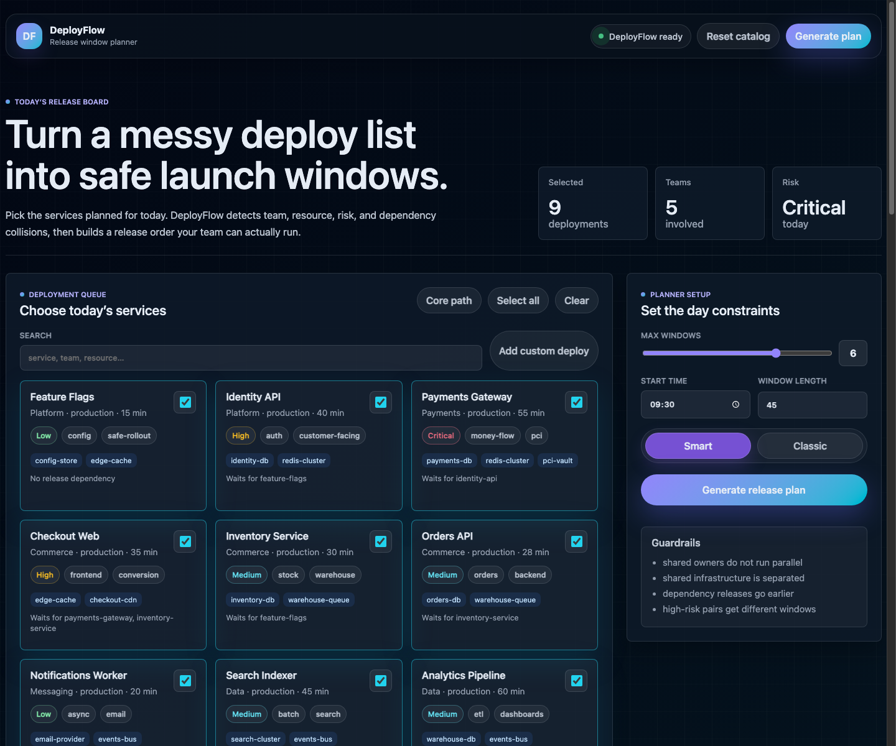
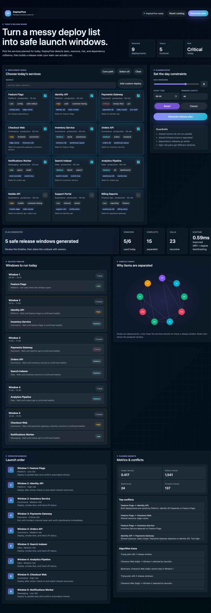

# DeployFlow: Software Deployment Window Planner Using Graph Coloring

Prepared by: Artem Pasichnyk and Yaroslav Kondratenko  
Course: SDT 202 Design and Analysis of Data Structures and Algorithms  
Topic: Map Coloring Problem / Graph Coloring  
Repository: **replace with your clickable GitHub repository link before submission**

---

## Abstract

DeployFlow is a software deployment window planner that applies graph coloring to daily release coordination. Each planned service deployment is modeled as a vertex. A conflict edge is created when two deployments should not run in parallel because they share an owner, use the same infrastructure, have a dependency relationship, or both have high operational risk. Deployment windows are modeled as colors. A valid coloring becomes a safe release plan in which conflicting deployments are placed into different time windows. The project implements the classical graph coloring backtracking algorithm in Java and extends it with practical improvements such as most-constrained-vertex ordering, degree-based tie breaking, least-constraining color choice, forward checking, and chronological dependency validation. The result is a working web product with a Java backend, a modern dashboard interface, a conflict graph visualization, release timeline, runbook, and execution metrics.

Keywords: graph coloring, map coloring, backtracking, deployment planning, release scheduling, constraint satisfaction

---

## 1. Introduction and Problem Description

The classical map coloring problem asks whether regions of a map can be colored so that adjacent regions do not share the same color. Algorithmically, the map is transformed into a graph: regions become vertices, shared borders become edges, and colors become labels assigned to vertices.

DeployFlow uses the same idea for software deployment planning. Engineering teams often have several service updates planned for one day. Running all of them at the same time is unsafe when releases affect the same infrastructure, are owned by the same team, or depend on each other. DeployFlow converts the daily deployment list into a conflict graph and assigns each deployment to a release window.

### Mapping

| Real deployment concept | Graph coloring concept |
| --- | --- |
| Service deployment | Vertex |
| Unsafe parallel relation | Edge |
| Deployment window | Color |
| Safe release plan | Valid graph coloring |

The goal is to find a valid assignment of deployments to a limited number of windows. If no assignment exists, the system reports that the selected number of windows is insufficient.

---

## 2. Classical Algorithm for the Problem

The classical algorithm for graph coloring is recursive backtracking. It processes vertices one by one and tries to assign one of the available colors. A color is safe if none of the already colored adjacent vertices has the same color. If a vertex cannot receive any available color, the algorithm backtracks to a previous vertex and tries another color.

The algorithm is complete: if a valid coloring exists for the chosen number of colors, backtracking will eventually find it. Its worst-case search space is exponential because it may need to explore many color combinations.

---

## 3. Pseudocode of the Classical Algorithm

```text
FUNCTION COLOR_VERTEX(vertexIndex):
    IF vertexIndex = numberOfVertices:
        RETURN true

    FOR color FROM 1 TO numberOfColors:
        IF IS_SAFE(vertexIndex, color):
            colors[vertexIndex] = color

            IF COLOR_VERTEX(vertexIndex + 1):
                RETURN true

            colors[vertexIndex] = 0

    RETURN false

FUNCTION IS_SAFE(vertexIndex, color):
    FOR each neighbor of vertexIndex:
        IF colors[neighbor] = color:
            RETURN false
    RETURN true
```

---

## 4. Java Implementation of the Algorithm

The algorithm is implemented in:

```text
src/com/deployflow/core/algorithm/GraphColoringSolver.java
```

Core classical function excerpt:

```java
private boolean classicColorVertex(int vertex, boolean[][] graph, int[] colors,
                                   int colorCount, PlannerMetrics metrics,
                                   List<String> trace) {
    metrics.countRecursiveCall();
    if (vertex == colors.length) {
        return true;
    }
    for (int color = 1; color <= colorCount; color++) {
        if (isClassicSafe(vertex, color, graph, colors, metrics)) {
            colors[vertex] = color;
            if (classicColorVertex(vertex + 1, graph, colors, colorCount, metrics, trace)) {
                return true;
            }
            colors[vertex] = 0;
            metrics.countBacktrack();
        }
    }
    return false;
}
```

Safety check excerpt:

```java
private boolean isClassicSafe(int vertex, int color, boolean[][] graph,
                              int[] colors, PlannerMetrics metrics) {
    metrics.countSafetyCheck();
    for (int other = 0; other < graph.length; other++) {
        if (graph[vertex][other] && colors[other] == color) {
            return false;
        }
    }
    return true;
}
```

---

## 5. Real-World Situation

The selected real-world situation is software deployment planning. A development team may need to deploy multiple services on the same day, for example:

- Feature Flags
- Identity API
- Payments Gateway
- Checkout Web
- Inventory Service
- Orders API
- Notifications Worker
- Search Indexer
- Analytics Pipeline

Some deployments cannot safely run in the same window. Examples:

- Checkout Web depends on Payments Gateway and Inventory Service.
- Payments Gateway and Identity API share critical identity/payment infrastructure.
- Two high-risk deployments should not run at the same time.
- Services owned by the same team should not be deployed in parallel because the same people monitor them.

DeployFlow automatically builds a conflict graph from these rules and assigns the selected deployments to safe release windows.

---

## 6. Main Program Implementation

The driver program is implemented in:

```text
src/com/deployflow/web/DeployFlowApp.java
```

The main program starts a Java HTTP server, serves the web interface, exposes API endpoints, and calls the graph coloring planner.

Main entry point excerpt:

```java
public static void main(String[] args) throws Exception {
    DeployFlowApp app = new DeployFlowApp();
    if (args.length > 0 && "--demo".equalsIgnoreCase(args[0])) {
        app.runConsoleDemo();
        return;
    }
    int port = args.length > 0 ? parsePort(args[0]) : DEFAULT_PORT;
    app.startServer(port);
}
```

Planning API excerpt:

```java
private void handlePlan(HttpExchange exchange) throws IOException {
    String body = new String(exchange.getRequestBody().readAllBytes(), StandardCharsets.UTF_8);
    Map<String, Object> request = Json.asObject(Json.parse(body));
    List<DeploymentTask> tasks = parseTasks(request);
    PlannerOptions options = PlannerOptions.fromMap(request);
    Map<String, Object> result = planner.plan(tasks, options);
    sendJson(exchange, 200, result);
}
```

Repository link: **replace with your clickable GitHub repository link before submission**

---

## 7. Improved Algorithm

The improved algorithm keeps the same graph coloring foundation but reduces the amount of unnecessary search.

### Improvements

1. **Most constrained vertex first**: choose the uncolored deployment with the fewest currently available windows.
2. **Degree tie-breaker**: if several deployments have the same number of available windows, choose the one with the most conflict edges.
3. **Risk tie-breaker**: if still tied, choose the higher-risk deployment first.
4. **Least-constraining color**: prefer a window that leaves more choices for neighboring deployments.
5. **Forward checking**: after assigning a deployment, check whether every uncolored deployment still has at least one possible window.
6. **Dependency order validation**: if deployment A depends on deployment B, B must be assigned to an earlier window.

### Improved Algorithm Pseudocode

```text
FUNCTION IMPROVED_COLORING():
    IF all vertices are colored:
        RETURN true

    vertex = SELECT_MOST_CONSTRAINED_VERTEX()
    orderedColors = ORDER_COLORS_BY_LEAST_CONSTRAINING_VALUE(vertex)

    FOR each color IN orderedColors:
        IF IS_DEPLOYMENT_SAFE(vertex, color):
            colors[vertex] = color

            IF EVERY_UNCOLORED_VERTEX_HAS_A_VALID_COLOR():
                IF IMPROVED_COLORING():
                    RETURN true

            colors[vertex] = 0

    RETURN false
```

This improvement is especially useful when the deployment graph is dense or when dependency constraints make many branches infeasible.

---

## 8. Screenshots of Program Execution

### Part 2.1. Screenshots: Dashboard



### Part 2.2. Screenshots: Generated Release Plan



### Part 2.3. Console Execution

```text
DeployFlow console demo
Solved: true
Message: Deployment plan generated.
Algorithm: Improved MRV + degree backtracking
Windows used: 4

Window 1 09:30-10:15
  - Feature Flags [Platform, Low]

Window 2 10:15-11:00
  - Identity API [Platform, High]
  - Inventory Service [Commerce, Medium]

Window 3 11:00-11:45
  - Payments Gateway [Payments, Critical]
  - Orders API [Commerce, Medium]
  - Search Indexer [Data, Medium]

Window 4 11:45-12:30
  - Checkout Web [Commerce, High]
  - Notifications Worker [Messaging, Low]
```

---

## 9. Contribution of Each Team Member

Replace this section with the final confirmed effort analysis before submission.

| Team member | Contribution |
| --- | --- |
| Artem Pasichnyk | Algorithm implementation, planner rules, testing, report sections. |
| Yaroslav Kondratenko | Web interface, product design, screenshots, presentation sections. |

---

## 10. One-Page Thesis / Abstract Description

Software deployments are often planned under time pressure. When several service updates are scheduled for the same day, teams must decide which deployments can run in parallel and which must be separated. Manual planning becomes unreliable when services share infrastructure, depend on each other, or require the same engineering team for monitoring.

This project presents DeployFlow, a software deployment window planner based on graph coloring. Each deployment is represented as a graph vertex. A conflict edge is added between two vertices when the corresponding deployments cannot safely run at the same time. Reasons for conflict include shared team ownership, shared infrastructure, dependency relations, and high operational risk. Each deployment window is represented as a color. Therefore, producing a safe deployment plan becomes equivalent to finding a valid graph coloring where connected vertices receive different colors.

The project implements the classical recursive backtracking algorithm for graph coloring in Java. It then improves the classical method using most-constrained-vertex ordering, degree-based tie breaking, least-constraining color selection, forward checking, and chronological dependency validation. The improved algorithm is used in a working product interface that allows users to select planned deployments, configure available windows, generate a release timeline, inspect the conflict graph, and follow an operator runbook.

The implementation demonstrates how a classical map coloring problem can be transformed into a practical engineering tool. DeployFlow shows that graph coloring is not limited to geographic maps; it is a general method for assigning limited resources under conflict constraints. In this project, colors are not visual labels but deployment windows that help engineering teams reduce operational risk and coordinate releases more safely.

---

## 11. Project Evaluation and Final Thoughts

DeployFlow successfully applies the graph coloring model to a real-world scheduling problem. The product is useful because it converts a deployment list into a concrete release timeline and exposes the reasoning behind the plan. The conflict graph and algorithm metrics also make the result transparent: users can see why services were separated and how much search the solver performed.

The main limitation is that real deployment planning may include additional constraints such as stakeholder availability, external maintenance windows, rollback risk, and environment-specific rules. These can be added in future versions as additional graph edges or domain constraints.

---

## References

[1] T. R. Jensen and B. Toft, *Graph Coloring Problems*. New York: Wiley-Interscience, 1995.  
[2] R. Diestel, *Graph Theory*. Berlin: Springer.  
[3] A. Levitin, *Introduction to the Design and Analysis of Algorithms*. Boston: Pearson.  
[4] Oracle, *Java SE 21 API Specification: jdk.httpserver module*.  
[5] MDN Web Docs, *HTML, CSS, JavaScript, and Fetch API documentation*.
